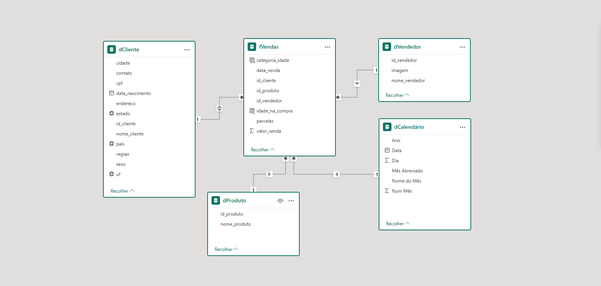
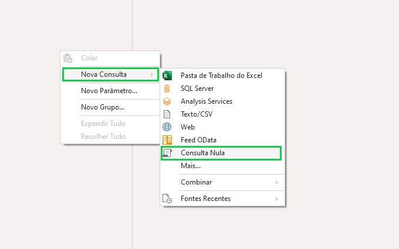
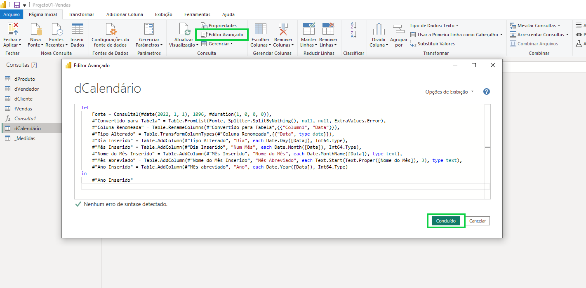
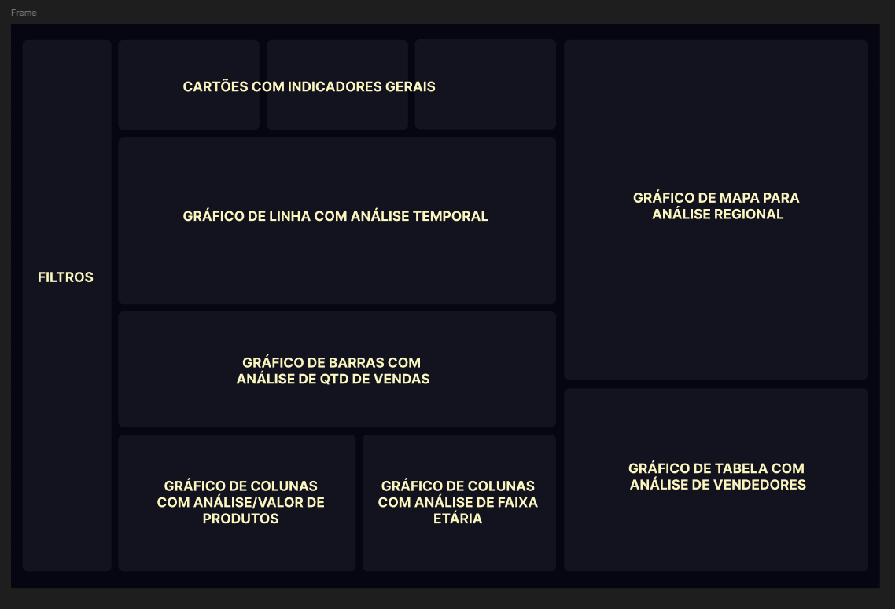

## 📊 PROJETO DE BI: ANÁLISE DE VENDAS COM POWER BI       
<a href="https://app.powerbi.com/view?r=eyJrIjoiMTNjYzliZTktYjRlNi00MmJkLTlhMGUtNTg0Yzk2YmFiMzViIiwidCI6IjJjNWRmYzQxLWQxMjUtNDAxZi04ZDgzLTY2M2UzNzc0ODcwNyJ9" target="_blank">
  
</a>


<h3>1. 📄 <u>VISÃO GERAL</u></h3> 
Este projeto de Business Intelligence (BI), desenvolvido com o Power BI, tem como foco a análise estratégica de vendas em um cenário empresarial genérico, porém amplamente aplicável a diferentes segmentos de mercado.


Foram utilizados dados sintéticos gerados por inteligência artificial, simulando padrões realistas de clientes, especialistas de vendas, produtos e registros transacionais no período de 2022 a 2024. A arquitetura do projeto foi planejada para representar uma operação comercial com abrangência nacional, cobrindo todas as regiões e estados do Brasil.

O escopo da análise concentrou-se exclusivamente nas vendas realizadas, sem a inclusão de custos ou despesas, com o objetivo de extrair insights relevantes sobre o desempenho comercial, comportamento dos consumidores e atuação dos vendedores em diferentes contextos.
<hr style="border: 1px solid #0066cc; opacity: 0.5;">
<h3>2. 🎯 <u>OBJETIVOS</u></h3>

Demonstrar a aplicação prática da inteligência de negócios (BI) no contexto de vendas, evidenciando todo o processo — da transformação de dados brutos à entrega de insights estratégicos e acionáveis.

O projeto visa destacar competências técnicas em **Modelagem de Dados**, **ETL**, construção de **medidas com DAX** e **storytelling com dados**, utilizando o Power BI como ferramenta principal para gerar valor analítico e apoiar a tomada de decisão comercial.
<hr style="border: 1px solid #0066cc; opacity: 0.5;">
<h3>3. 🧩 <u>MODELAGEM E FONTES DE DADOS</u></h3>

#### Fontes de Dados Utilizadas

Os dados utilizados para compor as tabelas foram extraídos de arquivos Excel. Os arquivos estão disponíveis no repositório vinculado.

#### Tabelas Dimensão

- **dCliente**: informações dos clientes (fonte: Excel)  
- **dVendedor**: dados dos especialistas em vendas (fonte: Excel)  
- **dProduto**: catálogo de produtos comercializados (fonte: Excel)  
- **dCalendário**: calendário completo para análise temporal (criada no Power Query)

#### Tabela Fato

- **fVendas**: registros das transações comerciais realizadas (fonte: Excel)

#### Tratamento dos Dados

Todos os arquivos passaram por processos de limpeza, incluindo:

- Remoção de duplicatas  
- Tratamento de valores nulos  
- Padronização e formatação de tipos de dados

#### Estrutura do Modelo Dimensional

O modelo de dados segue a arquitetura estrela, com uma tabela fato central (**fVendas**) conectada a múltiplas tabelas dimensão.  
Essa modelagem facilita a análise com granularidade por tempo, localização, perfil de cliente e produto.

Imagem do modelo relacional abaixo:

<p align="center">
  
</p>

#### Diagrama de Relacionamento

Abaixo estão os relacionamentos entre as tabelas do modelo:

- **fVendas** `*--1` **dCliente** (chave: `id_cliente`)  
- **fVendas** `*--1` **dVendedor** (chave: `id_vendedor`)  
- **fVendas** `*--1` **dProduto** (chave: `id_produto`)  
- **fVendas** `*--1` **dCalendário** (chave: `data_venda → Data`)


#### Destaque: Tabela dCalendário

A tabela de calendário foi construída diretamente no **Power Query**, servindo como base para análises temporais estratégicas, como:

- Comparações de desempenho entre anos e meses  
- Identificação de padrões sazonais  
- Navegação por hierarquias temporais (`Ano > Mês > Dia`)

📝 **Observação:** Embora tenha sido desenvolvida em M (Power Query), essa tabela pode ser criada também com DAX ou Python, conforme a necessidade do projeto.

 #### Construção Técnica da Tabela Calendário

Para viabilizar análises temporais no modelo dimensional, foi desenvolvida uma tabela de datas personalizada diretamente no **Power Query**, utilizando o **Editor Avançado**. O processo seguiu os seguintes passos:

1. Clique com o botão direito em qualquer área do painel de consultas e selecione:  
   `Nova Consulta > Consulta Nula`

<p align="center">
  
</p>

2. No menu superior, clique em **"Editor Avançado"**.  
3. Na janela aberta, foi inserido o seguinte script em **M** (linguagem do Power Query):
   
   >(Script está disponível em um arquivo dCalenário.txt em anexo)

<p align="center">
  
</p>

Esse script gera uma tabela com **1.096 dias consecutivos** a partir de `01/01/2022`.  
A partir da coluna de datas, são derivadas colunas auxiliares como:

- Dia  
- Mês  
- Nome do Mês  
- Mês Abreviado  
- Ano  

Essas colunas fornecem suporte à **navegação temporal** e permitem análises **sazonais**, **comparativas** e **hierárquicas** no Power BI.

#### Colunas Adicionais com DAX

Com a linguagem **DAX**, foram adicionadas duas colunas à tabela `fVendas` para enriquecer a análise com dados demográficos dos clientes.

**Fórmula DAX:**

- `idade_na_compra`: calcula a idade do cliente no momento da venda.
```DAX
idade_na_compra = 
DATEDIFF(RELATED(dCliente[data_nascimento]), fVendas[data_venda], YEAR)
```

- `categoria_idade`: segmenta os clientes em faixas etárias estratégicas.
```DAX
idade_na_compra = 
DATEDIFF(RELATED(dCliente[data_nascimento]), fVendas[data_venda], YEAR)
```
Essas variáveis foram fundamentais para identificar perfis de consumo e padrões de comportamento por idade.
<hr style="border: 1px solid #0066cc; opacity: 0.5;">
<h3>4. 🔢 <u>MEDIDAS E CÁLCULOS (DAX)</u></h3>

Esta seção apresenta as principais medidas desenvolvidas em DAX (Data Analysis Expressions) para análise de desempenho de vendas, classificadas entre métricas básicas e indicadores comparativos.

#### Métricas Básicas

- **Total Vendido**  - Soma do total de vendas realizadas.

```DAX
Total_Vendido = SUM(fVendas[valor_venda])
```
- **Total Vendido (com validação)** - Versão alternativa que retorna 0 quando nenhum ano está selecionado.

```DAX
Total Vendido 2 = 
  IF(
  NOT HASONEVALUE('dCalendário'[Ano]),0,
    	SUM(fVendas[valor_venda])
)
```
- **Quantidade de Vendas** - Contagem total de registros de vendas.

```DAX
 Qtd de Vendas = COUNTROWS(fVendas)
```

- **Ticket Médio** - Valor médio por transação.

```DAX
 Tiket Médio = DIVIDE([Total Vendido], [Qtd de Vendas], 0)
```
#### Análise Comparativa

- **Total Vendido no Ano Anterior AA** - Recupera o valor total de vendas do mesmo período do ano anterior.

```DAX
Total_Vendido_AA =
    VAR AnoAnterior = CALCULATE(
        [Total_Vendido],
        DATEADD('dCalendário'[Data], -1, YEAR)
    )
    RETURN IF(ISBLANK(AnoAnterior), 0, AnoAnterior)
```

- **Total Vendido Ano Anterior AA (com validação)** - Similar à anterior, com verificação para evitar cálculo sem ano selecionado.

```DAX
Total_Vendido_AA2 =
IF(
    NOT HASONEVALUE('dCalendário'[Ano]),
    0,
    VAR AnoAnterior = CALCULATE(
        [Total_Vendido],
        DATEADD('dCalendário'[Data], -1, YEAR)
    )
    RETURN IF(ISBLANK(AnoAnterior), 0, AnoAnterior)
)
```
- **Crescimento/Declínio (%) Ano a Ano** - Percentual de variação entre o ano atual e o anterior.

```DAX
AA_2_% =
IF(
    NOT HASONEVALUE('dCalendário'[Ano]),
    0,
    DIVIDE(
        [Total_Vendido] - [Total_Vendido_AA],
        [Total_Vendido_AA],
        0
    )
)
```
- **Ano Selecionado** - Retorna o ano selecionado ou "Global" caso nenhum esteja filtrado.

```DAX
Ano Selecionado =
    VAR VAno = SELECTEDVALUE('dCalendário'[Ano])
    RETURN IF(ISBLANK(VAno), "Global", VAno)
```
- **Indicador de Tendência** - Representa visualmente a tendência de crescimento ou queda.

```DAX
 Sinal = 
 SWITCH(TRUE(),
    [AA 2 (%)] > 0, UNICHAR(9650),  // ▲
    [AA 2 (%)] < 0, UNICHAR(9660),  // ▼
    UNICHAR(9654)                   // ►
 )  
```
As medidas DAX desenvolvidas nesta seção foram essenciais para analisar o desempenho de vendas com clareza.  
Foram utilizadas funções como `SUM`, `COUNTROWS`, `DIVIDE`, `IF`, `VAR`, `SWITCH`, `HASONEVALUE`, `SELECTEDVALUE`, `DATEADD` e `UNICHAR` para realizar cálculos, comparar períodos, controlar filtros e criar indicadores visuais.
<hr style="border: 1px solid #0066cc; opacity: 0.5;">
<h3>5. 📈 <u>DASHBOARD E VISUALIZAÇÕES</u></h3>

#### Identidade Visual

O design do dashboard foi pensado para proporcionar uma visualização clara e agradável.  
As cores e o plano de fundo foram definidos com base em um protótipo desenvolvido no Figma.

**Cores utilizadas:**
- **Plano de fundo:** `#1E1E1E`
- **Quadros dos gráficos:** `#D9D9D9`
- **Cores dos gráficos no Power BI:**
  - **Azul:** `#4678A6`
  - **Amarelo:** `#F0E199`

#### Protótipo

A base visual foi estruturada com foco em hierarquia da informação e facilidade de leitura dos indicadores.  
O layout segue o protótipo proposto, respeitando os espaços para **KPIs**, **filtros** e **gráficos**.

<p align="center">
  
</p>

#### Resultado Final

O dashboard final entrega uma análise visual completa e interativa dos dados de vendas, segmentados por **tempo**, **produto**, **região** e **perfil do cliente**.

<p align="center">
  
</p>

<a href="https://app.powerbi.com/view?r=eyJrIjoiMTNjYzliZTktYjRlNi00MmJkLTlhMGUtNTg0Yzk2YmFiMzViIiwidCI6IjJjNWRmYzQxLWQxMjUtNDAxZi04ZDgzLTY2M2UzNzc0ODcwNyJ9" target="_blank">
  
</a>

#### Componentes do Dashboard

#### KPIs Principais
- **Cartão 1 – Total Vendido Global**: Apresenta os valores totais de vendas, quantidade de vendas e ticket médio considerando todo o período.  
- **Cartão 2 – Total Vendido no Ano**: Exibe as mesmas métricas focando apenas no ano selecionado.  
- **Cartão 3 – Total Vendido vs AA**: Compara as vendas do ano atual com o ano anterior, incluindo a variação percentual.  

##### Gráfico de Linhas
- Exibe a evolução mensal do total vendido, comparando ano atual e ano anterior.

##### Gráficos de Colunas
- **Quantidade de Vendas por Mês**: Mostra o volume de vendas em cada mês do ano.  
- **Total Vendido por Produto**: Permite identificar o total vendido de cada produto.  
- **Faixa Etária dos Clientes**: Apresenta a distribuição percentual por faixa de idade dos clientes.  

##### Gráfico de Mapa
- Representa o total de vendas por região/estado, utilizando bolhas proporcionais.

##### Tabela de Vendas por Vendedor
- Mostra o desempenho individual de cada vendedor com total vendido, quantidade de vendas e ticket médio.

#### Filtros Disponíveis
A navegação no dashboard é feita por meio de filtros por:
- Ano  
- Mês  
- Produto  
- Vendedor  
- Região  
<hr style="border: 1px solid #0066cc; opacity: 0.5;">
<h3>6. 💡 <u>INSIGHTS ESTRATÉGICOS</u></h3>

#### Crescimento Anual (2022 – 2024)
- **2022 → 2023**: Crescimento de **1,72% AA** — estabilidade no pós-pandemia.  
- **2023 → 2024**: Aumento expressivo de **11,94% AA** — reflexo de estratégias comerciais mais eficazes.  
- **2024** se mostra como um ano de referência, com desempenho sólido e potencial de repetição.  

**Meta sugerida para 2025**: R$ 1.165.053,15 (crescimento de **24%** — dobrando a taxa de 2024).

#### Desempenho dos Vendedores

#### Especialista 001
- Maior volume vendido: **R$ 416,5K** (*23% acima da média*).  
- Destaque por quantidade (**295 vendas**) e ticket acima da média (**R$ 1.411,98**).  
**Sugestão**: Potencial para ser mentor do time.

#### Especialistas 003 e 006
- Menores vendas: **R$ 345,2K** e **R$ 322,8K** (*18% abaixo da média*).  
- Tickets médios baixos: **R$ 1.297,86** e **R$ 1.362,28**.  
**Sugestão**: Treinamento em técnicas de venda ou reavaliação do mix de produtos.

#### Insights de Produtos
- **Produto005** é líder absoluto: **R$ 761,9K** em 3 anos — o dobro do Produto004.  
- **Produto004** e **Produto001** tiveram os piores desempenhos: **R$ 376,8K** e **R$ 396,4K**.  

**Pontos de atenção**:
- Preço elevado?  
- Baixa divulgação?  
- Público mal segmentado?

**Reflexão**: O que está sendo feito com o Produto005 que não se aplica aos demais?

#### Insights Regional e Estado
- **Sudeste** e **Nordeste** dominam as vendas:  
  - Sudeste: **R$ 842.558,71**  
  - Nordeste: **R$ 791.058,46**  
  - Juntos representam **62,7%** do total.
- Regiões **Sul**, **Norte** e **Centro-Oeste** somam **37,3%** das vendas.

#### Top 10 estados em vendas


| Posição | Estado             | Total Vendido    | Participação |
|---------|--------------------|------------------|--------------|
| 1°      | Minas Gerais       | R$ 376.756,07    | 14,47%       |
| 2°      | São Paulo          | R$ 346.172,94    | 13,29%       |
| 3°      | Rio Grande do Sul  | R$ 265.442,31    | 10,19%       |
| 4°      | Bahia              | R$ 211.820,22    | 8,13%        |
| 5°      | Mato Grosso        | R$ 163.051,09    | 6,26%        |
| 6°      | Pernambuco         | R$ 157.011,41    | 6,03%        |
| 7°      | Maranhão           | R$ 149.932,75    | 5,76%        |
| 8°      | Pará               | R$ 139.275,50    | 5,35%        |
| 9°      | Ceará              | R$ 134.070,94    | 5,15%        |
| 10°     | Rondônia           | R$ 101.174,83    | 3,89%        |

#### Destaques Numéricos

- **Minas Gerais e São Paulo** juntos representam **27,8%** do total.
- **Top 3 estados** concentram **38%** das vendas.
- **Rondônia** é o único da **região Norte** no Top 10.
- Apenas o **Top 10** superaram **R$ 100 mil** em vendas.
- **Amapá, Roraima, Paraíba, Distrito Federal** e **Acre** tiveram o **menor desempenho**.

#### Faixa Etária dos Clientes

- O público entre **26 e 35 anos** é o mais expressivo: **61% das vendas** — mais que todas as outras faixas somadas.

#### Insights Sazonais

- **Melhores meses** (repetidos nos 3 anos): **Dezembro**, **Agosto** e **Março**.
- **Piores meses** (repetidos nos 3 anos): **Fevereiro**, **Setembro** e **Janeiro**.

**Sugestão:** Refinar campanhas promocionais nos meses de baixo desempenho para alavancar resultados.
<hr style="border: 1px solid #0066cc; opacity: 0.5;">
<h3>7. 🚀 <u>CONCLUSÃO E PRÓXIMOS PASSOS</u></h3>

Este projeto teve como foco oferecer uma visão geral e estratégica do desempenho comercial da empresa entre **2022 e 2024**.  
A análise dos dados históricos permitiu identificar **padrões de crescimento**, **comportamento de vendas**, **sazonalidade** e **performance por produto, região e especialista**.

#### Próximas sugestões para evolução da análise:

- **Painel de Metas**  
  Criar um painel com **metas corporativas e individuais (por vendedor)**, possibilitando o monitoramento contínuo e uma gestão de performance mais eficiente.

- **Funil de Vendas**  
  Medir a **jornada do lead até a conversão**, com taxas de conversão por etapa, volume de oportunidades e tempo médio de fechamento.  
  Ideal para identificar gargalos e otimizar a estratégia comercial.

- **Painel Financeiro**  
  Desenvolver uma visão mensal do **faturamento bruto e líquido**, **custos** e **margem por produto**, permitindo comparações com o planejado e decisões financeiras mais assertivas.

A consolidação dessas sugestões poderá transformar a empresa em uma **organização ainda mais orientada por dados**, promovendo **ganhos de eficiência**, **foco em resultados** e **tomada de decisão ágil e fundamentada**.

---

#### 🔗 Link do Projeto

<a href="https://app.powerbi.com/view?r=eyJrIjoiMTNjYzliZTktYjRlNi00MmJkLTlhMGUtNTg0Yzk2YmFiMzViIiwidCI6IjJjNWRmYzQxLWQxMjUtNDAxZi04ZDgzLTY2M2UzNzc0ODcwNyJ9" target="_blank">
  
</a>

<h4>Contato</h4>

Se você tiver dúvidas ou sugestões, sinta-se à vontade para entrar em contato:

- 📧 **E-mail**: user.franklinalves@gmail.com
- 🌐 **LinkedIn**: [Franklin Alves de Lima](https://www.linkedin.com/in/franklinalvesdelima/)


Ficarei feliz em conversar e receber feedback sobre o projeto!

